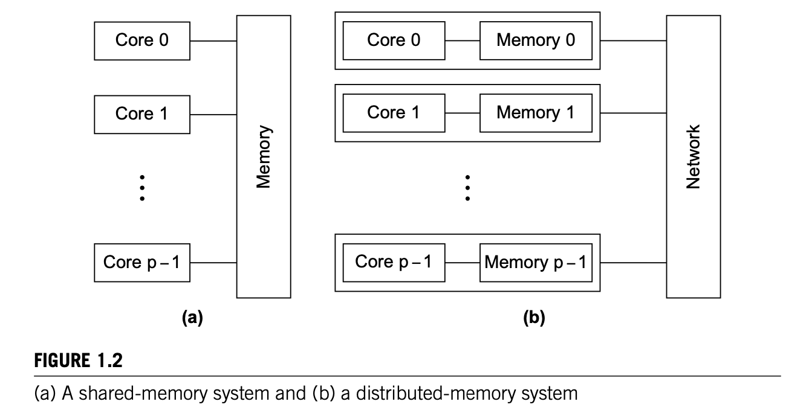

# 1. Why Parallel Programming

## Why we build parallel systems/hardware?
1. **Moore's Law: The number of transistor (electronic switches) on microchips doubles every two years.** 
2. **Dennard Scaling: As MOSFET(silicon transistor) features shrink, switching time and power consumption fall proportionally.**
3. smaller transistor => faster processors => higher power consumption (P = UI) => higher heat resistence => unreliable and up to the limit on single core processor.
4. **Chip yield**: percentage of usable chips over all manufactured chips.
5. multiple, relative simple, complete cores/processing unit on a single chip is better than single, complex processors, due to commercial reason. (cheaper)

## Why we need to write parallel program?
1. serial program cannot directly exploit the presence of multiple cores, and run multiple instance of a serial program on multiple cores are somewhat useless.
2. Translation programs, which intended to automatically translate a serial program into a parallel programs. Still limited success on this.
3. rewrite the serial program into a parallel program by translating the serial common constructs into efficient parallel constructs, but may terribly in-efficient. e.g., parallelizing a matrix multiplication into a sequence of parallel dot products is to slow compare to serial version. (dot products on each core, somewhat data parallelism)
4. Best parallelization of a serial program may be simply step back and re-write the whole algorithm.

## How do we write parallel programs
1. **Task-Parallelism**: Partition the various tasks carried out in solving the problems among the multiple cores.
2. **Data-Parallelism**: Partition the data used in solving the problems among the multiple cores, in which each core carries out more or less similar operations on its part of the data.

Example: Mr A, B, C and D are marking several exam papers, first situation is every marker get serveral copies of the exam papers and do the marking, which is data parallelism. Second situation is Mr A marks first two questions, B marks second two questions and so on among all the exam paper, which is considerred as task parallelism.

1. When the cores need the coordination on accessing the resource and order of execution is required, which complex the program. 
2. **Communication**: One ore more cores send messages to another core.
3. **Load balancing**: All the cores are assigned roughly the same amount of works to compute.
4. **synchronization**: (race condition: computation result is depend on the order of execution, cores are racing for the shared resource), we synchornize the cores to ensure mutex, and avoid the race condition.

## What we'll be doing
1. **Shared memory systems**: the cores can share access to the computer's memory, we can&should coordinate the cores by having them examine and update shared-memory locations. Pthread, OpenMP
2. **Distributed memory systems**: each core has its own, private memory spot, cores must communicate *explicitly* by doing message passing across a network or so. MPI(Message Passing Interface)

## Concurrent, parallel, distributed 
1. In concurrent computing, a program is one in which multiple tasks can be in progress at any instant. (even multi-tasking in a single core machine)
2. In parallel computing, a program is one in which multiple tasks cooperate closely to solve a problem simultaneously.
3. In distributed computing, a program may need to cooperate with other programs to solve a problem simultaneously. 
4. Compare to parallel program, in which multiple tasks run on cores that are physically close to each other and using either share-memory system or distributed-memory system, distributed program tend to be more *loosely coupled*.