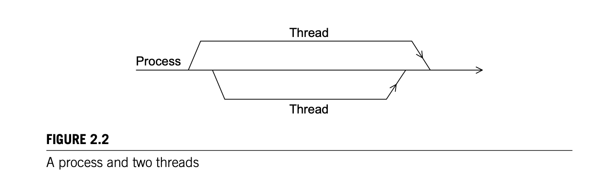

# 2. Parallel Hardware and Parallel Software

## Backgrounds

### The von Neumann architecture
1. Main memory, central-processing unit (CPU) or processor or core, and an interconnection between the main memory and the CPU.
2. Main memory: a collection of *locations*, each *location* consists of an *address* (used to access this location) and the *content* of the location (either instruction or data be stored)
3. CPU: Control unit and an arthmetic logic unit (ALU). Control unit decides which instructions in a program should be executed next, and the ALU indeed executes the decided instruction.
4. Intermediate data, information about the state of an executing proggram are stored in very fast storage called *registers*, control unit has a special register: *program counter*, stores the address of the next instruction to be executed.
5. Interconnection: connect CPU and the main memory, used to transfrom data between them, also called a bus. Which consists of a collection of parallel wires and some hardware controlling access to the wires.
6. Traditional von Neumann architecture executes a single instruction and only few piece of data at a time, i.e., Single instruction single data (SISD)
7. Read/fetched: data/instructions are transferred from memory to CPU
8. Write/stored: data are transferred from the CPU to memory.

9. The separation of memory and CPU is often called the *von Neumann bottleneck*, since CPU execute the instruction in a speed way more faster (100 times faster in 2010) than the pending instruction/data be fetched to CPU via interconnection/bus, CPU will stay in idle, which wastes computational resource. i.e., exec speed >> fetch speed
10. Example: Imagine that a large company has a single factory (the CPU) in one town and a single warehouse (main memory) in another. Further imagine that there is a single two-lane road joining the warehouse and the factory. All the raw materials used in manufacturing the products are stored in the warehouse. Also, all the finished products are stored in the warehouse before being shipped to customers. If the rate at which products can be manufactured is much larger than the rate at which raw materials and finished products can be transported, then it’s likely that there will be a huge traffic jam on the road, and the employees and machinery in the factory will either be idle for extended periods or they will have to reduce the rate at which they produce finished products.
11. Modification on classical von Neumman architecture is required to address the bottleneck problem.

### Processes, multitasking, threads
1. Operating system: major software, used to manage hardware and software resources on a computer. Determines which programs can run and when they can run. It also controls the allocation of memory to running programs and access to peripheral devices(hard disks, network interface cards, etc).
2. When user runs a program, OS will create a process-an instance of a computer program that is being executed.
3. Process includes:
   1. The executable machine language program.
   2. A block of memory, which will include the executable code, a call stack that keeps track of active functions, a heap, and some other memory locations.
   3. Descriptors of resources that the operating system has allocated to the process— for example, file descriptors.
   4. Security information—for example, information specifying which hardware and software resources the process can access.
   5. Information about the state of the process, such as whether the process is ready to run or is waiting on some resource, the content of the registers, and information about the process’ memory.
4. Most OS support **multitasking**, i.e., apparent simultaneous execution of multiple programs. Even possible for single-core hardware.
5. Time slice: each program runs a small interval of time, OS then switch to different program.
6. Block: process is waiting for a resource and stop executing.
7. Even part of the process is blocked, the rest of the program can still continue to execute. Process can have multiple part of program as threads.
8. Threading: mechanism for programmers to divide their programs into more or less independent tasks in which one task be blocked and the others can run still.
9. Thread: more light-weighted than process, share same memory, executable and IO device within same process. Thread switching is faster than process switching. Only unshared parts are **Program Counter, Call stack**.
10. If a process is the **master** thread of execution and threads are started and stopped by the process, then we can envision the process and its subsidiary threads as lines: when a thread is started, it **forks** off the process; when a thread terminates, it **joins** the process. See Figure 2.2.

## Modifications to the Von Neumann Model
### The Basics of Caching
1. Von Neumman model bottleneck: the memory access speed is far slower than the CPU execution speed.
2. Rather than transporting a single instruction or data item, we can use an effectively wider interconnection, an interconnection that can transport more data or more instructions in a single memory access. Also, rather than storing all data and instructions exclusively in main memory, we can store blocks of data and instructions in special memory that is effectively closer to the registers in the CPU.
3. Cache: a collection of memory locations that can be accessed in less time than some other memory locations.
4. CPU Cache: cache which CPU can access more quickly than it can access the main memory.
5. Locality: The principle that an access of one location is followed by an access of a *nearby* location.
   1. spatial locality: After accessing one memory location (instruction or data), a program will typically access a nearby location.
   2. temporal locality: In the near future.
   3. Wider interconnection to exploit the principle of locality.
   4. Instead of passing a sinlge instruction or data, memory access will operate on blocks of data and instruction, called **cache blocks or cache lines**. One cache line/block is about 8 or 16 times storage than a single memory location.
   5. Cache is divided into levels based on access speed, L1,L2,L3,... first level(L1) is the smallest but fastest, others are larger and slower.
   6. 