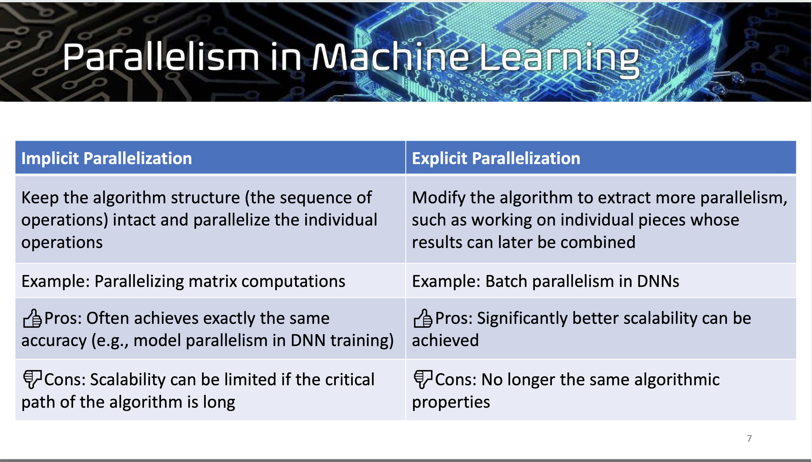

## Overview
1. Parallelism: dominat paradigm for future computing
2. multi-core processor: single integrated circuit, two or more processing unit, read/write in parallel
3. gpu: specialized processors for graphics and floatng-point arithmetic calculations, more cheaper core than cpu
4. Parallel Computer Paradigms:
   1. multicore/SMP/symmetric multi-processor: shared memory, multi core
   2. HPC/distributed memory: multi process, individual memory, comm via network bus
   3. SIMD/GPU: one core/control unit, muliple ALU/arithmetic unit
5. possible performance issue: load imbalance among different core; communication overhead; mutex, deadlock, blocking


## Hardware
1. Moore's Law: The number of transistors on microchips doubles every two years
2. Dennard Scaling: As MOSFET (silicon transistor) features shrink, switching time and power consumption fall proportionally
3. due to laws above: smaller transistors -> faster processors -> increased power consumption -> increase heat -> unreliable processors, leads to single core limit due to overheat, undermine parallel computing before 2003.
4. rise of parallel computing after 2003 due to:
   1. better chip yield in multicore
   2. overheating in faster clock frequency, so switch to multiple cores on a chip and stop increasing clock frequency
   3. rise of gpu and ML
5. challenges in parallel computing:
   1. diffcult to write parallel code without bugs
   2. locking/race condition in shared memory system
   3. communication overhead in multi-thread/process inter-communication
   4. load imbalance of processors, bottleneck of Amdahl's law, speed up tends to fixed with increasing #processors
6. execution feature: fetch instruction, decode, fetch operand; execute, store result, next...
7. von neumann bottleneck: separation of memory and cpu
   1. disk/ main memory access speed << cache & register speed << cpu execution speed
   2. solution: avoid false sharing, reuse values in fast memory; use larger cache, more cache hit than miss, use vectorization as multiple read/write, pre-fetch
   3. cache, on same cpu chip, faster than main memory, L1,2,3.
   4. principle of locality: 
      1. spatial locality: accessing near location, like same row values
      2. temporal locality: access in near future
8. cache hit: data found in cache
9. cache miss: data not found in cache, only accessible through main memory
10. cache line: blocks on data
11. virtual memory: function as secondary storage cache
12. page table: translate the virtual address into physical address
13. ILP (Instruction Level Parallelism): multiple function units simultaneously executing instructions
14. pipeling: different function units arranged in stages
    1.  e.g., multiple (a,b,c)s, arrange three unit for each part, then u1 do a, both u2 do b and u1 do snd a,...
15. multiple issues: multiple instructions initiated simultaneously by multiple replicated function units
    1.  static: funits are scheduled at compile time
    2.  dynamic: funits are scheduled at runtime
16. speculation: compiler / unit can make a guess about an instruction during branch, executes the instruction on the basis of the guess, if guess false, just go back and recompute another branch
17. hardware multi-threading: system continues to work if current thread is blocked.
    1.  fine grained: switch threads after each instruction, skipping threads that are blocked, round-robin
    2.  coarse grained: only switch threads that are blocked waiting for time consuming operation to complete, may starvation
    3.  simultaneous multithreading (SMT): allow multiple threads to make use of multiple units
    4.  switching also have overhead.
18. Flynn's Taxonomy
    1.  SISD (classical von Neumann), MISD, SIMD, MIMD
19. GPU, vector processor: SIMD, vectorization
    1.  drawback: all ALU have to execute same instruction or remain idle
    2.  operate synchronously
    3.  ALU have no instruction storage
    4.  efficient for data parallelism
20. Vector processor:
    1.  pros: vectorizing compilers can identify the structs to vectorize or not; high memory bandwidth, use all item in cache line.
    2.  cons: cannot handle irregular data structs, not scalable, expensive vs single-core processor
21. GPU: can run more than one instruction stream on single core
22. MIMD: shared memory system or distributed memory system
23. uniform memory access: all cores can access all the memory location directly and same time
24. non-uniform memory access: some cores share same memory location, multiple group of them, connected via bus, access memory space belong to other group may need to go through other cores.
25. distributed system: connected by network
26. interconnection networks:
    1. shared memory interconnection: connected via switch, high cost, like a grid, faster than bus
    2. distributed: direct interconnect, each switch is directly connected to processor-memory pair
       1. toroidal mesh, bisection bandwidth n2/4 fully connected network
    3. indirect interconnect: switch may not directly connected
    4. hypercube: every adjacent node's id only differ one bit, d-dimension, node have d neighbors
    5. butterfly network: unfolded hypercube, d-dmin has (d+1)2^d switches, n=2^d procs, diameter=logn, bisection bandwidth=n


## Software
1. Not easy and efficient to write translation program that auto convert serial program to parallel program, new parallel algorithm always better than translated one
2. task parallelism: partition into various sub-tasks
3. data parallelism: partition data, every core do similar operation on different part of the data
4. concurrent computing: one program, multiple sub-tasks can be in progress at any instant
5. parallel computing: one program, multiple sub-tasks cooperate closely to solve problems
6. distributed computing: program cooperate with other programs to solve problems
7. process: instance of running program, memory block, descriptors, sec info, process state
8. thread is more light weight, one process can control multiple threads
9. multitasking single core: every task get turn/time slice, do round robin
10. compiler: check syntax, translate to assembly, optimize
11. register allocation: how to allocate data in register, use graph coloring,
12. compiler optimization still not enough
13. SPMD: use if-else on single program, run on multiple process/thread.
14. dynamic thread: master thread create/terminate thread, efficient resource use, thread creation/termination overhead
15. static thread: thread pool created first and do work, only terminate until cleanup, better performance, may waste thread when some of them idle
16. race condition: when units access shared variable simultaneously, result in error without protection.
    1.  solution to race condition: critical section, mutex, busy waiting (not efficient)
17. thread-safe code: can be simultaneously executed by several threads
18. data dependencis: RAW, WAR, WAW
19. C uses row-major to store array.
20. ikj and kij is faster
21. inconsistent data in cache vs main memory:
    1.  write-through: caches updating the data in main memory at the time it is written to cache
    2.  write-back: cache mark data in the cache as dirty, when cache line replaced by a new cache line from memory, dirty line will write to memory
22. cache mapping, where to put data on cache when load from main memory:
    1.  full associative: place any location, n-way set associative: can be put in one of n places
    2.  direct mapped: each cache line has unique location to put in cache
    3.  replace least recent used cache line by new fetched one when overlap
23. programmer no control on cache / update
24. cache coherence: uniformity of shared resource data that ends up stored in multiple local caches.
    1. solution1: Snoopy caching ensures cache coherence with limited scalability. a bus catch any signal from all local cache, mark local data in local cache to invalid.
    2. solution2: directive based cache coherence: ds directory, store status of all cache line, when see updates, consult the directory and each core cache controller invalidate self local cache line if related.
25. false sharing: two unrelated variable set on **same cache line**, update one result re-fetch from main memory, leads to low scalability.
    1.  solution1: padding data to full cache line size
    2.  solution2: lock/mutex
    3.  solution3: optimize memory allocation
26. coordination, communication, load balancing, synchronization
27. reduction lowerbound: logn
28. message transmission time = a + m/b; a: latency.s, m: message_size.byte, b: bandwidth: bytes/s; 
29. gap = 1/b, time for 1 byte gap.
30. message latency = a + #Chunks * gap
31. running time = exec time + waiting time + delivery time = #Flops * g + #word_moved * gap + #message * a
32. computation intensity (CI): #flops/#words_moved = f/m
33. scalability:
    1.  strong: fix efficiency (E), fix problem size, increase process count
    2.  weak: fix efficiency (E), increase problem size + process count together
34. speedup: S = Ts / Tp, 
   1. Ts: serial runtime
   2. Tp: parallel runtime
   3. #core: P
   4. speedup == performance gain
   5. S = Told/Tnew = 1 / ((1-a) + a/k)
   6. a: speed up portion %
   7. k: speed up factor/#process
   8. ideal S = P
35. efficiency: E = S / P = 1 / P((1-a) + a/k)
   1. ideal: E = 1
   2. worse: E = 0, S tends to 0 and P tends to inf
36. logn < n^0~1


## Pthread
1. threads are contained inside a process
2. can share memory within the parent process
3. POSIX: portable operating system interface, unix standard, library can be linked to C, API for multi-threading, only on POSIX systems
4. support parallelism (data+task)， synchronization, no explicit support on communication.
5. busy waiting, may be removed by compiler, waste cpu time.
6. mutex, thread be blocked when acquiring the lock will be waiting in the queue, until other unlock.
7. sempahores: non-binary advanced control of locking
8. sem_init(sem, shared, init_val), shared = 0 if among thread
9. barrier
10. condition variable, suspend exec until event
    1.  signal: guarantee to hold the lock when return
    2.  wait: release the lock and wait for signal
11. pthread parallel linked list: use read-write lock best.
    1.  when only read, no blocking
    2.  if write, block both simultaneous read/write operation until former operation done.
12. thread unsafe operation: strtok: caches the input line by declaring variable to have static storage class, but shared among threads.
    1.  asctime
    2.  gethostbyaddr
    3.  gethostbyname
    4.  localtime
    5.  rand
```C
read_lock() {
  mutex.lock();
  while (writer)
    unlocked.wait(mutex);
  readers++;
  mutex.unlock();
}

read_unlock() {
  mutex.lock();
  readers--;
  if (readers == 0)
    unlocked.signal_all();
  mutex.unlock();
}

write_lock() {
  mutex.lock();
  while (writer || (readers > 0))
    unlocked.wait(mutex);
  writer = true;
  mutex.unlock();
}

write_unlock() {
  mutex.lock();
  writer = false;
  unlocked.signal_all();
  mutex.unlock();
}
```

## OpenMP
1. OpenMP support both data and task parallelism, thread-based, explicit parallelism
2. OpenMP is a compiler directive, may supported by gcc compiler nowaday
3. OpenMP is multi-thread
4. OpenMP critical directive is slower than atomic directive, can use special load-modify-store instruction
5. shared memory /multicore
6. not supported by all vendors, not check data dependencies and deadlock, not guarantee i/o same file is sync, 
7. num thread may not as defined unless forced via env var, system has limitation
8. firstprivate: init private with prev value
9. default(none) should manual specify
10. 2 parallel for is slower than 1 parallel + 2 for
11. flush cache to main memory


## MPI
1. distributed memory system, collection of processors
2. no MPI code after finalize
3. no shared variable, no lock
4. procs 0 do stdin, no two procs can access same file
5. SPMD
6. recv can recover the sender information by status, without knowing size, sender, tag
7. MPI_Recv always block
8. MPI_Send will not return until you can use the send buffer. It may or may not block (it is allowed to buffer, either on the sender or receiver side, or to wait for the matching receive).
9. MPI_Bsend May buffer; returns immediately and you can use the send buffer. A late add-on to the MPI specification. Should be used only when absolutely necessary.
10. MPI_Ssend will not return until matching receive posted
11. MPI_Rsend May be used ONLY if matching receive already posted. User responsible for writing a correct program.
12. MPI_Isend Nonblocking send. But not necessarily asynchronous. You can NOT reuse the send buffer until either a successful, wait/test or you KNOW that the message has been received (see MPI_Request_free). Note also that while the I refers to immediate, there is no performance requirement on MPI_Isend. An immediate send must return to the user without requiring a matching receive at the destination. An implementation is free to send the data to the destination before returning, as long as the send call does not block waiting for a matching receive. Different strategies of when to send the data offer different performance advantages and disadvantages that will depend on the application.
13. MPI_Ibsend buffered nonblocking
14. MPI_Issend Synchronous nonblocking. Note that a Wait/Test will complete only when the matching receive is posted.
15. MPI_Irsend As with MPI_Rsend, but nonblocking.
16. MPI may hang or deadlock if all proc do MPI_Send&blocked and no one recv
17. MPI non-block operation must be waited or tested
18. mpi/cuda needs specialized compilers, but openMP can be used by typical gcc compiler.


## Matrix
1. Cannon less efficient than SUMMA algorithm because it works on square matrices.
2. 1d,2d,3d layout, summa, cannon all have same exec/computation time.
3. efficiency: summa is most efficient in practice.
4. 3d layout use larger M (fast memory limited capacity) to achieve optimal communication 
5. Computation intensity: block(b) > strassen() > matrix-matrix(2);  
   3d(n/p^1/3, M = n^2/p^2/3) > cannon > summa > strassen > 1d
6. Cannon algorithm storage requirements remain constant and are independent of the number of processors.
7.  theorem: #words_moved = lower_bound(n^3/sqrt(M)), M is fast memory size
8.  block mult: #words_moved = lower_bound(N^3 * b^2), 
    N is #block dim = n/b, communication optimal in single core
9.  #words_moved_per_proc = lower_bound(n^3/P*sqrt(M)) = lower_bound(n^2/sqrt(P)), M = n^2/P
10. allow non-conflicting unicast and use unicast to simulate broadcast in 2log(n)


## CUDA
1. single instruction multiple data
2. GPU vs CPU: GPU: thousands of weaker core, optimized for parallel processing, specialized computing. CPU: few strong cores, best for serial processing, general purpose
3. application: dynamic fluid simulation, gaming, vr
4. multi-threaded, data parallel processor, good at data parallelism, can do task parallelism among different block
5. GPU don't have out-of-order control logic, branch predictor, memory pre-fetcher. But only have control, ALU and cache&memory
6. CPU core share limit context, can exec instruction independently, while GPU core share instruction stream (SIMD/SIMT)
7. GPU use branch redundancy by running multiple branches on different core and pick correct one finally
8. GPU core may stall on next instruction if previous cores haven't finish on same one. No L1 cache
9. as accelerator
10. host: cpu+cpu mem (L1,2,3 cache, host DRAM)
11. device: gpu+gpu mem (dev L2 cache, dev DRAM)
12. streaming processor ~ vector processor
13. cuda requires customized compiler, as extension of C
14. __global__ (kernel code) call by cpu, run on gpu
    __device__ call by gpu, run on gpu
    __host__ call by cpu, run on cpu
15. dev/host pointer can be passed, do pointer arithmetic by each other but no de-referenced/read/write from opponent memory.
16. unified memory: accessible by both CPU and GPU
17. <<<#block, #threadsPerBlock>>>
    1.  blockDim.x – the number of threads per block
    2.  gridDim.x – the number of blocks per grid
    3.  threadIdx.x – the thread index within a block 
    4.  blockIdx.x – the block index within a grid
18. can sync and communicate among same block thread, may sync among grid in CUDA 9 https://stackoverflow.com/questions/6404992/cuda-block-synchronization
19. host can access gpu global memory use cudaMemcpy
20. __syncthreads() only sync same block threads, every same block thread should all call this
21. EXCLUSIVE_PROCESS – the GPU is assigned to only one process at a time, and individual process threads may submit work to the GPU concurrently.
22. DEFAULT – multiple processes can use the GPU simultaneously. Individual threads of each process may submit work to the GPU simultaneously.
23. GPU is optimized for graphics processing and simulations.


## Sorting
1. bucket sort has load imbalance
2. sample sort ensures load balance at worst 2n/m elements, vs therotical n/m
3. splitter as -inf, m/2, 3m/2, .....
4. parallel merge sort, use binary search during merging, log^3n
5. bitonic sort: log^2n
6. [time] sample sort < merge sort < bitonic sort (a worse than b) (parallel)
7. [speedup] bitonic > merge > sample
8. serial mergesort better than serial bitonic sort
9. mesh slower than hypercube.


## ML
1. supervised / semi / unsupervised / reinforcement
2. Graph neural networks can predict graph connectivity
3. TPU is more optimize for NN than GPU
4. systolic-array mult, hardware parallel algo, On for matrix mult
5. Metric embedding allows non-metric data to be processed by neural networks
6. CNN can be parallelized by parallel matrix multiplications
7. Semi-supervised learning can learn new data labels from partially labelled data



## Cloud
1. deliver computer as service
2. virtualization, abstraction of computing resource, like multi os on one physical laptop, key tech for cloud computing
3. EC2 even allow to launch instance in diff+multiple locations
4. google cloud: use many cheap machine run linux for mega file system, allow component failure, bugs
5. scale up: small number of high-end server, need smp(symm multithread processing) machines, not cost effective
6. scale out: big number of commodity low-end servers, cost effective, low price
7. google file system (GFS):
   1. no gpu, no shared memory
   2. normal component failure, use constant monitoring/error detection, fault tolerance, auto recovery
   3. huge file, multi gb file
   4. single master, store data location in gfs chunck server
   5. chunck server, store data
   6. client, query location from master then query data from chunck server based on former location
   7. files broken to chuncks, may store in multiple chunck servers
   8. each chunck is replicated on 3 default server for recovery and fault tolerance / backup
8. MapReduce: (key, value)
9. fast recovery:
   1.  if task crash / fault recovery
       1.  retry another node
       2.  repeat fail same task, end it
       3.  require *deterministic* user code
   2.  if node crash
       1.  relaunch current task on other node, input via file system replication
   3.  slow task
       1.  launch snd copy on another node
       2.  take the first finished output
10. Hadoop: output re-input from file
11. Spark: in-memory computing primitives, optimized across operators; can retain data in memory/cache for next step, more iterative the better
12. Resilient distributed datasets: immutable, paritioned collections of objects, can be cached in faster memory for reuse, can do transformation & action
13. interactively: build RDD, transformation (filter), action
14. RDD tracks lineage info that can be used to efficiently re-build lost data partitions
15. mapreduce support large data processing


## DLT
1. stateful: c-s comm protocol cannot proceed unless server full recover previous client history info
2. stateless: server continue to work even after losing the info
3. orphan (client crashes and previous work request has been sent to server),
   1. solution 1: extermination: client keeps a log, read when reboot, kill the orphan by notifying server, cons on high overhead on maintaining the log
   2. solution 2: reincarnation: divide time slice, client broadcast epoch when reboot, any server heard that kill the orphans, cons when disconncted network
   3. solution 3: expiration: each c-s operation lease a time T for computation, if not finished on time, should ask server for another lease 
4. only exist t-resilient protocol when t < n/3 with total process n
5. byzantine protocol must guarantee to deliver and may out of order (sync / half-sync), honest party must consistent (no spy), progress is mae in definite time (livenss)
6. bitcoin: decentralized ledger, no permission on maintain ledger, robust against malicious attack
7. bitcoin may suffer 51% attack, 51% attacker not working on longest chain and branch out the chain and make longest chain, beat others, not practical
8. snd image collision-resistant: no one can feasible find x2 given x1, such that x1 != x2 and H(x1) = H(x2)
9.  block: Hash(prev_block):time:nonce:data
10. proof of work, computation puzzle takes lowerbound(difficulty) to solve, upperbound(1) to verify, solve by randomly try all y, can be parallelized
11. honest miners always extend longest chain, assume >0.5 miners are honest
12. difficulty is adjust time by time, not too long/short to find a block (every 10 mins is good), if time too long, drop diffculty
13. ASIC resistance: decentralization, ASIC cannot always win, reduce gap between ASIC and GPU/CPU
14. puzzle with more memory to solve the puzzle, every one need access to main memory frequently
15. scrypt, asic resistant, but hard to verify
16. ethash, asic resistant, easy to verify


